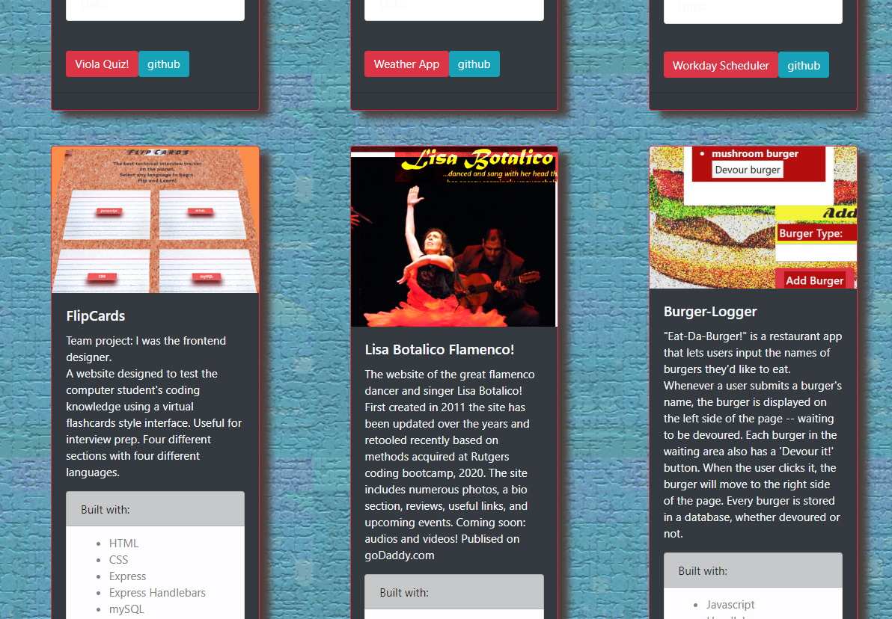

# Joel Rudin React-Portfolio

## A collection of web projects utilizing both frontend and backend technologies and demonstrating some of my design concepts

## Technologies used:

- React
- JavaScript
- Node.js
- React Bootstrap
- CSS
- Photoshop

## List of Projects:

- Viola Quiz
- Weather-App
- Workday Scheduler
- Flipcards
- Lisa Botlico Flamenco!
- Burger-Logger
- HipGrandpa
- React Violinist Fan Page!
- YELLOWChat

## Deployment: https://boiling-beyond-86124.herokuapp.com/
